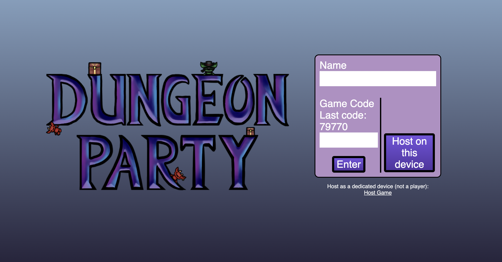
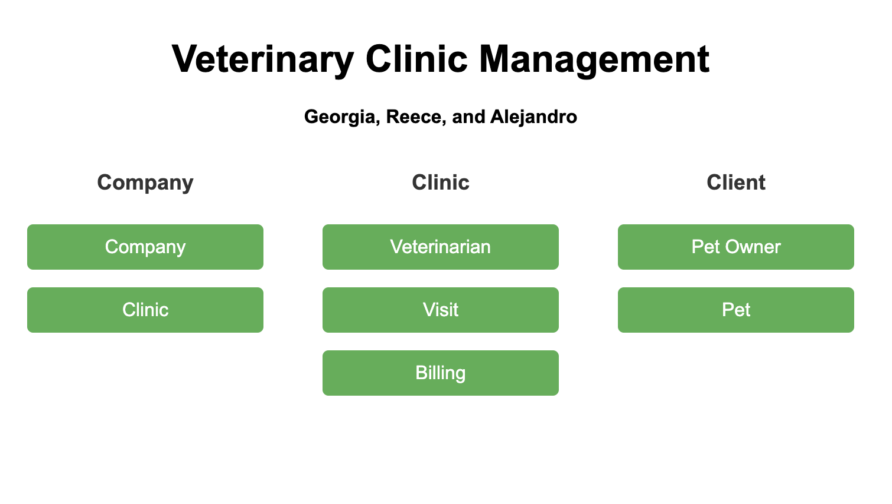

# Portfolio

## About Me:
Hi! I’m Georgia Crane, a Computer Science major with a minor in Statistics at the University of St. Thomas. Outside of academics, I enjoy a variety of hobbies including escape rooms, rock climbing, reading, drawing, and playing games. I also love spending time with friends and exploring creative outlets like pottery.

## Projects:

### Dungeon Party:
**Keywords:** Game Design, Full-stack Development, Multiplayer Game, Collaboration, Web Development 

**Description:**

Dungeon Party is a free, online multiplayer game designed for large groups to play together easily and accessibly. Unlike most team-based games that cap at four players, Dungeon Party is built to support larger groups, making it ideal for parties, classrooms, or social gatherings. It requires no specialized hardware, payments, or prior gaming experience, lowering the barrier to entry and maximizing inclusivity. This project emphasizes accessibility, teamwork, and large-scale collaboration.

As part of a group project, I contributed to both the brainstorming phase and the development of the front and back end, helping bring the game's concept to life through collaborative coding and design.

### Vet Management System:
**Keywords:** Database Design, Teamwork, Full-stack Development, Project Leadership

**Description:**

The Vet Management System is a sample web application built as a group project to practice full-stack development, with a focus on database design and front-end integration. The system managed data for pet owners, pets, veterinarians, clinics, billing, and company infrastructure for scalability. Users could view data in each table and access related data via a dynamic interface, showcasing relational database functionality in a clear and user-friendly way.

We used SQLite as the database, with SQLAlchemy and Flask to integrate the Python back end with a front end built using HTML. I led the integration of the front and back end and was solely responsible for the front-end design. I also contributed to the initial project idea and helped organize the database schema.

## Skills:

### Technical Skills
- Programming Languages: Python, TypeScript, HTML, CSS, C#, C++, Java, R, SQL, C
- Frameworks & Libraries: Flask, SQLAlchemy, pixi.js, sockets
- Tools & Platforms: GitHub, Visual Studio, SQLite, RStudio, PyCharm, IntelliJ, Eclipse
- Web & Database: Front-end design and development, back-end integration, CRUD operations, database schema design, responsive web design

### Soft Skills
- Organization
- Adaptability
- Communication
- Presenting & Public Speaking
- Problem Solving
- Collaboration
- Attention to Detail

## Resume:
I have linked my resume [here](./pdfs/GeorgiaCraneResume.pdf).

